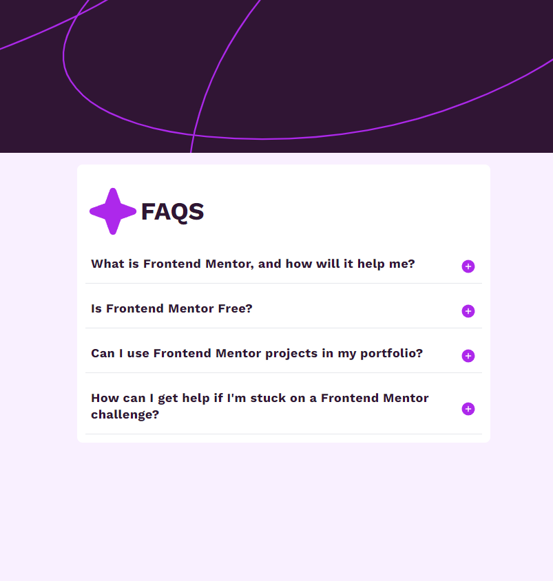
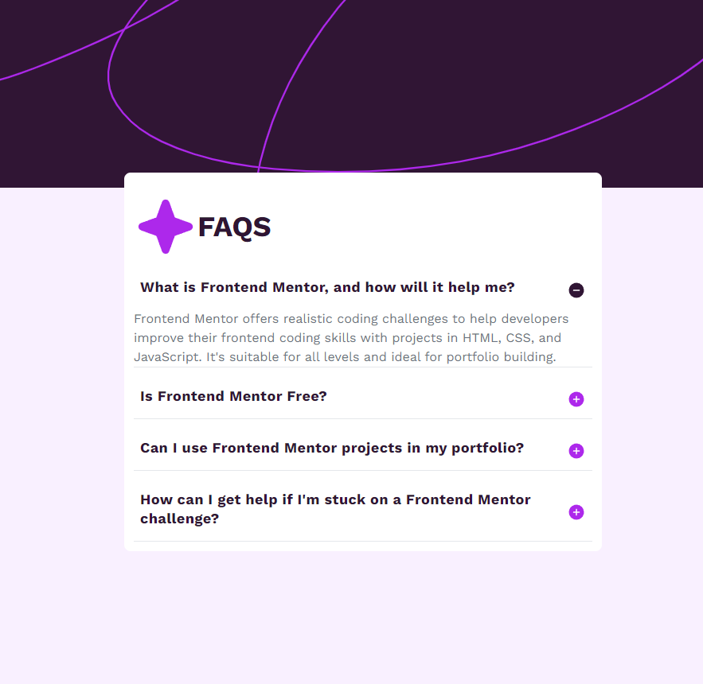
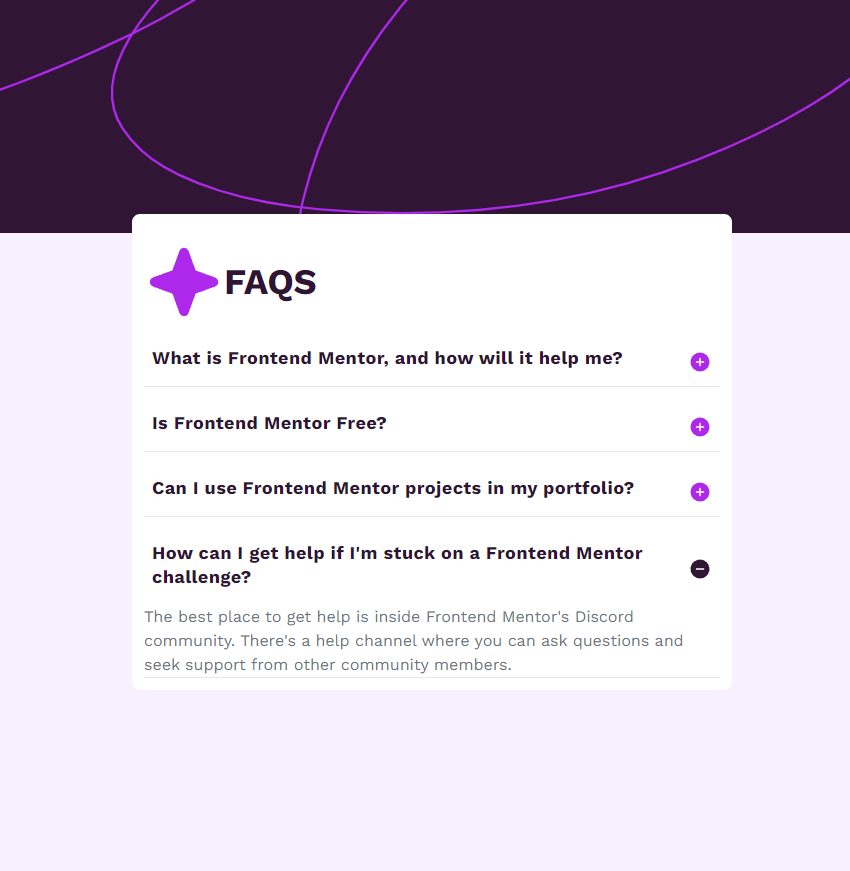

# FAQ accordion

This project was aimed at learning about faq accordian structure and styling layout in ReactJS, TailwindCSS, and others.

## Table of contents

- [Overview](#overview)
  - [The challenge](#the-challenge)
  - [Screenshot](#screenshot)
  - [Links](#links)
- [My process](#my-process)
  - [Built with](#built-with)
  - [Useful resources](#useful-resources)
- [Author](#author)

## Overview

### The challenge

Users should be able to:

- Hide/Show the answer to a question when the question is clicked
- Navigate the questions and hide/show answers using keyboard navigation alone
- View the optimal layout for the interface depending on their device's screen size
- See hover and focus states for all interactive elements on the page

### Screenshot

### Links

- Live Site URL: [Netlify FAQ Website](https://faq-lavol.netlify.app/)
- Solution URL: [Laura Dev Frontend Mentor](https://www.frontendmentor.io/challenges/faq-accordion-wyfFdeBwBz/hub?share=true)

## My process

### Built with

- [React](https://reactjs.org/) - JS library
- TailwindCSS
- Vite
- Google Fonts
- Semantic HTML5 markup
- CSS custom properties
- Flexbox
- CSS Grid
- Mobile-first workflow

### Useful resources

- [Google Fonts] (https://fonts.google.com/)
- [FAQ accordian Flowbite] (https://flowbite.com/docs/components/accordion/)
- [TailwindCSS Background Images] (https://v1.tailwindcss.com/docs/background-size)

## Author

- Website - [Laura V](www.lauradeveloper.com)
- Frontend Mentor - [@lavollmer](https://www.frontendmentor.io/profile/yourusername)
- Github - [@lavollmer](https://github.com/lavollmer)
